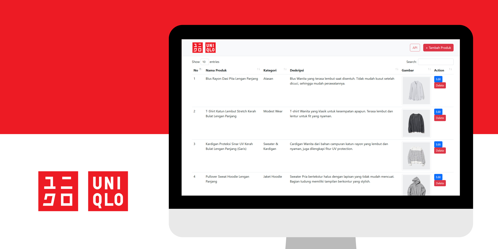

##

### UNIQLONE, Uniqlo CRUD Clone Application

## 📙 Description

This is my assignment in the Multiplatform Programming course. This task involves creating a web and mobile application. The web part is responsible for performing CRUD operations on data and displaying it through a REST API to the mobile application. Our group developed the web application using the PHP programming language without using any framework, and for the mobile application, we used the Dart programming language and the Flutter framework.

